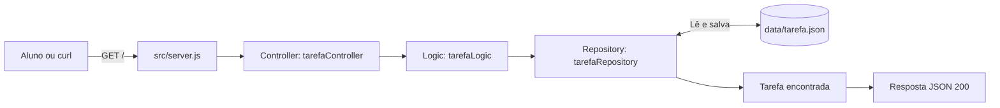
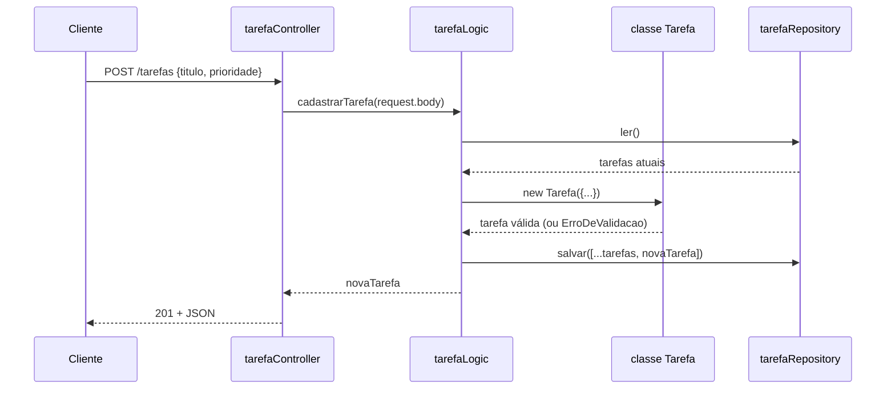

# API em camadas com classe

Exemplo resolvido a partir do esqueleto
[api-desenvolvimento](https://github.com/williambarrilli/api-desenvolvimento).
Ele implementa `GET /tarefas` e `POST /tarefas` mantendo a separação em
camadas e usando uma classe `Tarefa` para validar os dados. Use como
referência do que se espera em um Pull Request de issue:

```text
controller -> logic -> repository -> data/tarefa.json
                 |
                 +-> models (classe Tarefa)
```

## Fluxo visual



Em resumo: o aluno faz uma requisição, o `server.js` encaminha para o
controller, a logic coordena o caso de uso e o repository acessa o arquivo.

## Como executar

Pré-requisito: Node.js instalado.

Na pasta do projeto, instale as dependências:

```bash
npm install
```

Inicie a API:

```bash
npm start
```

Durante o desenvolvimento, use o Nodemon:

```bash
npm run dev
```

Para verificar a qualidade do código sem executar testes unitários:

```bash
npm run lint
```

A API ficará disponível em `http://localhost:3000`.

## Endpoint inicial

### `GET /`

Retorna a tarefa persistida no arquivo `data/tarefa.json`:

```json
{
  "id": 1,
  "titulo": "Aprender Express",
  "descricao": "Implementar a primeira tarefa da API",
  "prioridade": "media",
  "concluida": false
}
```

Teste com:

```bash
curl http://localhost:3000/
```

### `GET /tarefas`

Lista todas as tarefas salvas em `data/tarefa.json`.

```bash
curl http://localhost:3000/tarefas
```

### `POST /tarefas`

Cadastra uma tarefa. `titulo` é obrigatório; `descricao` é opcional e
`prioridade` aceita `baixa`, `media` (padrão) ou `alta`.

```bash
curl -X POST http://localhost:3000/tarefas \
  -H "Content-Type: application/json" \
  -d '{"titulo":"Estudar camadas","prioridade":"alta"}'
```

Resposta `201`:

```json
{
  "id": 2,
  "titulo": "Estudar camadas",
  "descricao": "",
  "prioridade": "alta",
  "concluida": false
}
```

Se o título faltar ou a prioridade for inválida, a resposta é `400`:

```json
{ "mensagem": "O campo titulo é obrigatório" }
```

### Como o `POST` passa pelas camadas



A validação fica na classe `Tarefa` (`src/models/tarefa.js`): uma tarefa
inválida não chega a ser criada. O controller só traduz o resultado em
status HTTP (`201`, `400` ou `500`).

## Organização do código

- `src/server.js`: configura o Express e registra a rota.
- `src/controllers/tarefaController.js`: recebe a requisição e monta a resposta HTTP.
- `src/logic/tarefaLogic.js`: representa a regra de negócio do caso de uso.
- `src/models/tarefa.js`: classe `Tarefa`, que valida os dados, e a classe `ErroDeValidacao`.
- `src/repositories/tarefaRepository.js`: lê e grava diretamente o arquivo JSON.
- `data/tarefa.json`: armazenamento inicial da tarefa.

O repository recria o arquivo com a tarefa padrão se ele ainda não existir.

## Próximos passos (exercícios)

- Criar `GET /tarefas/:id` para buscar uma tarefa.
- Permitir alterar uma tarefa usando `PUT` ou `PATCH`, validando com a classe `Tarefa`.
- Permitir remover uma tarefa usando `DELETE`.
- Adicionar um método `concluir()` na classe `Tarefa`.
- Criar tratamento centralizado de erros.
