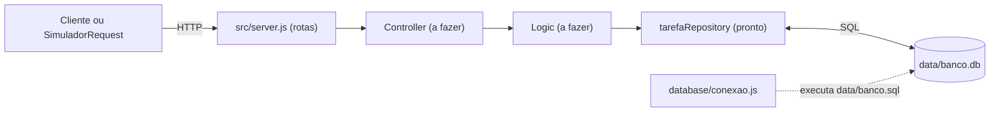

# API em camadas com SQLite

Exemplo **para completar**. A persistência em banco de dados já está pronta:
a conexão com o SQLite e o repository com o CRUD completo de tarefas. As
rotas, o controller e a logic ficam para você desenvolver.

```text
server -> controller -> logic -> repository -> data/banco.db
 (você)     (você)      (você)     (pronto)       (pronto)
```

É a mesma organização do [`api-camadas-com-classe`](../api-camadas-com-classe),
só que o arquivo `data/tarefa.json` foi trocado por um banco SQLite.

## Fluxo visual



## Pré-requisito

Node.js **22.13 ou superior**. O projeto usa o módulo `node:sqlite`, que já
vem no Node: não é preciso instalar nenhum pacote de banco de dados.

```bash
node --version
```

Ao iniciar, o Node mostra um aviso `ExperimentalWarning` sobre o SQLite. É
normal e não é um erro.

## Como executar

```bash
npm install
npm start
```

A API sobe em `http://localhost:3000`, ainda sem rotas. Para ver o repository
funcionando antes de criar qualquer rota, rode:

```bash
npm run exemplo
```

O script `src/exemplo-repository.js` lista, cria, busca, atualiza e remove uma
tarefa direto no banco, e mostra o resultado de cada operação no terminal.

## O banco de dados

O arquivo `data/banco.sql` cria as tabelas e os dados iniciais. A conexão
(`src/database/conexao.js`) executa esse script toda vez que a API inicia,
sem duplicar nada: `CREATE TABLE IF NOT EXISTS` não recria as tabelas e
`INSERT OR IGNORE` não repete os registros iniciais.

| Tabela | Colunas |
| --- | --- |
| `usuarios` | `id`, `nome`, `email` (único) |
| `tarefas` | `id`, `titulo`, `descricao`, `prioridade` (`baixa`, `media` ou `alta`), `concluida` (0 ou 1), `usuarioId` |

Dados iniciais: 3 tarefas e 2 usuários (Ana e Bruno).

O banco `data/banco.db` é gerado automaticamente e está no `.gitignore`. Para
voltar aos dados iniciais, apague o arquivo `data/banco.db` e inicie a API de
novo.

## O repository pronto

`src/repositories/tarefaRepository.js` exporta:

| Função | O que faz | Retorno |
| --- | --- | --- |
| `listar()` | Busca todas as tarefas | Array de tarefas |
| `buscarPorId(id)` | Busca uma tarefa | A tarefa, ou `null` se não existir |
| `criar(tarefa)` | Insere uma tarefa | A tarefa criada, com o `id` gerado pelo banco |
| `atualizar(id, campos)` | Altera só os campos informados | A tarefa atualizada, ou `null` se não existir |
| `remover(id)` | Remove uma tarefa | `true` se removeu, `false` se não existia |

Detalhes importantes:

- As funções são **síncronas**: não precisam de `await` (mas usar `await` não
  quebra nada).
- `concluida` é guardado como `0` ou `1` no banco, mas o repository sempre
  devolve `true` ou `false`.
- O repository **não valida regras de negócio**. Se receber um título vazio
  ou uma prioridade inválida, o próprio banco recusa e lança um erro
  (`NOT NULL constraint failed` ou `CHECK constraint failed`); com um
  `usuarioId` que não existe, o erro é `FOREIGN KEY constraint failed`.
  Validar os dados antes e responder `400` ou `404` é papel da logic e do
  controller.
- Os ids não são reaproveitados: depois de remover a tarefa 4, a próxima
  criada recebe o id 5.

## Exercício: complete a API

Crie `src/controllers/tarefaController.js` e `src/logic/tarefaLogic.js` e
registre as rotas em `src/server.js`:

| Rota | Sucesso | Erros |
| --- | --- | --- |
| `GET /tarefas` | `200` com o array de tarefas | — |
| `GET /tarefas/:id` | `200` com a tarefa | `400` id inválido, `404` não encontrada |
| `POST /tarefas` | `201` com a tarefa criada | `400` título vazio ou prioridade inválida |
| `PATCH /tarefas/:id` | `200` com a tarefa atualizada | `400` dados inválidos, `404` não encontrada |
| `DELETE /tarefas/:id` | `200` ou `204` | `404` não encontrada |

Regras:

- Só o repository fala com o banco. Controller e logic **não** importam a
  conexão nem escrevem SQL.
- A validação (título obrigatório, prioridade entre `baixa`, `media` e
  `alta`) fica na logic, antes de chamar o repository.
- O controller só traduz o resultado da logic em status HTTP.

Desafios extras:

- `GET /tarefas?concluida=true` para filtrar tarefas.
- Uma classe `Tarefa` em `src/models`, como no `api-camadas-com-classe`.
- Um `usuarioRepository` com o CRUD da tabela `usuarios`, seguindo o mesmo
  modelo do `tarefaRepository`.

Use o `SimuladorRequest.html`, na raiz deste repositório, para testar as rotas
pelo navegador.

## Organização do código

- `data/banco.sql`: tabelas e dados iniciais.
- `src/database/conexao.js`: abre o banco e executa o `banco.sql`.
- `src/repositories/tarefaRepository.js`: CRUD de tarefas com SQL.
- `src/exemplo-repository.js`: demonstração do repository sem rotas.
- `src/server.js`: configuração do Express, ainda sem rotas.
